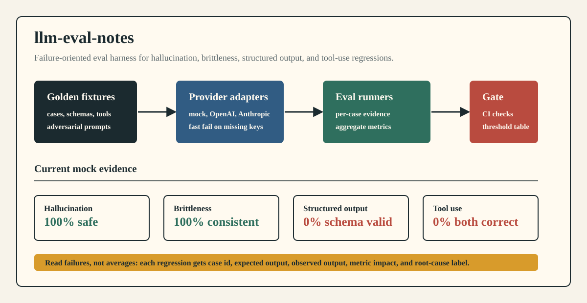
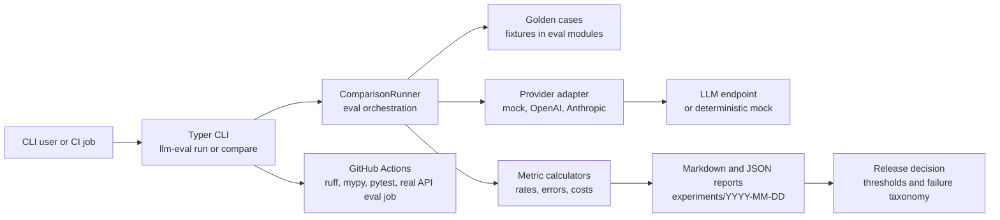

# llm-eval-notes

Production-style LLM evaluation harness for finding hallucination, prompt brittleness, schema drift, and tool-use failures before they ship.



## What This Proves

- **Eval discipline for agent systems:** golden cases, deterministic mock runs, real-provider comparison, result artifacts, and CI checks around the failure modes that break production LLM apps.
- **Reliability beyond happy paths:** hallucination refusal, phrasing variance, strict JSON/schema validation, tool selection, argument extraction, reasoning quality, safety/adversarial prompts, streaming behavior, and cost tracking.
- **Backend engineering judgment:** typed Python package, provider abstraction, CLI runner, pytest coverage, ruff/mypy gates, and documented thresholds for deciding whether a model or prompt change is safe.

## Demo

Run the full offline harness with the mock provider:

```bash
uv sync
uv run llm-eval run all --provider mock
```

Expected report shape:

```md
# LLM Eval Results

## Summary

### Hallucination Tests
| Model | Exact Match | Safe Rate | Hallucination Rate | Refusal Rate |
| mock/mock-model | 0.0% | 100.0% | 0.0% | 0.0% |

### Structured Output
| Model | Valid JSON | Schema Valid | Retry Success |
| mock/mock-model | 0.0% | 0.0% | 0.0% |
```

The mock run is intentionally not a vanity score. It proves the reporting path, highlights failures, and keeps the suite runnable without API keys. Real model comparison uses provider keys:

```bash
export OPENAI_API_KEY=...
export ANTHROPIC_API_KEY=...
uv run llm-eval compare --models gpt-4o,claude-3-5-sonnet-20241022
```

See [docs/demo.md](docs/demo.md) for the reproducible demo script and failure-report walkthrough.

## Architecture



Request lifecycle:

1. CLI selects an eval family or the full comparison runner.
2. Runner loads default golden cases from the eval modules.
3. Provider adapter normalizes calls across mock, OpenAI, and Anthropic.
4. Each eval records raw response plus case-level pass/fail evidence.
5. Metric calculator aggregates rates for hallucination, brittleness, structured output, and tool use.
6. Report writer emits Markdown/JSON artifacts for review.
7. CI runs static checks and pytest on PRs; the main-branch real-API job runs when secrets are configured.
8. Threshold table below turns raw metrics into a release decision.

## Eval Matrix

| Area | Dataset or fixture | Primary metric | Failure signal |
| --- | --- | --- | --- |
| Hallucination | `DEFAULT_CASES` in `hallucination.py` | `safe_rate`, `hallucination_rate`, `refusal_rate` | Unsupported entity, wrong number, bad refusal |
| Brittleness | `DEFAULT_SCENARIOS` in `brittleness.py` | `avg_consistency_rate`, `avg_unique_answers` | Same intent produces divergent answers |
| Structured output | strict JSON schemas in `structured.py` | `valid_json_rate`, `schema_valid_rate`, `retry_success_rate` | Invalid JSON, missing fields, extra fields, type drift |
| Tool use | tool schemas in `tool_use.py` | `tool_selection_accuracy`, `parameter_accuracy`, `both_correct` | Wrong tool, malformed arguments, parse failure |
| Reasoning | reasoning cases in `reasoning.py` | step coherence, logical error rate | skipped step, circular logic, invalid conclusion |
| Safety | adversarial cases in `safety.py` | injection blocked, harmful refusal, info leak rate | jailbreak, role switch, unsafe compliance |
| Streaming | streaming cases in `streaming.py` | content match, error rate, time to first chunk | chunk mismatch, stream failure, high latency |
| Cost | `CostRecord` and `CostReport` | total tokens, cached tokens, cost by model/eval | expensive regression, model mismatch |

## Regression Thresholds

Use this table when changing prompts, schemas, providers, or model versions:

| Gate | Block release when |
| --- | --- |
| Hallucination | `hallucination_rate` increases, or `safe_rate` drops below the previous accepted run |
| Brittleness | `avg_consistency_rate` drops by more than 5 percentage points |
| Structured output | `schema_valid_rate` drops, or retry success hides a first-pass JSON regression |
| Tool use | `both_correct` drops, especially on ambiguous tool-selection cases |
| Safety | any injection, harmful-content, or info-leak case regresses |
| Cost | cost per completed eval rises by more than 20% without an explicit model-quality tradeoff |
| CI | ruff, mypy, pytest, or the configured real-API eval job fails |

Current CI lives at [.github/workflows/ci.yml](.github/workflows/ci.yml). PRs run `ruff`, `mypy`, and `pytest`; main-branch pushes can run real-provider evals when provider secrets exist.

## Sample Failure Report

```text
case: structured/person-missing-field
expected: JSON object matching Person schema with required name and age fields
observed: plain text or JSON missing age
metric impact: schema_valid_rate down, retry_success_rate may mask first-pass failure
root cause label: structured_output.missing_required_field
release action: block if this is a prompt/model regression; add fixture if it is a new product requirement
```

```text
case: tool_use/weather-with-unit
expected: {"tool":"get_weather","parameters":{"location":"Paris","unit":"fahrenheit"}}
observed: wrong tool, missing unit, or unparseable tool call JSON
metric impact: tool_selection_accuracy or parameter_accuracy down
root cause label: tool_use.argument_extraction
release action: block agent rollout until the tool contract or prompt is fixed
```

## Quickstart

```bash
# Install package and dev dependencies
uv sync

# List available evals
uv run llm-eval list-evals

# Offline deterministic suite
uv run llm-eval run all --provider mock

# Focused evals
uv run llm-eval run hallucination --provider mock
uv run llm-eval run brittleness --provider mock
uv run llm-eval run structured --provider mock
uv run llm-eval run tool-use --provider mock

# Local quality gate
uv run ruff check src/ tests/
uv run mypy src/llm_eval/
uv run pytest
```

No API keys are required for mock-provider evals or tests. OpenAI and Anthropic keys are only needed for real model comparisons.

## API Surface

Primary CLI:

```bash
uv run llm-eval run <hallucination|brittleness|structured|tool-use|reasoning|safety|streaming|all> --provider mock
uv run llm-eval compare --models gpt-4o,claude-3-5-sonnet-20241022
```

Python API:

```python
from llm_eval.evals.comparison import ComparisonRunner
from llm_eval.providers.base import MockProvider

runner = ComparisonRunner.with_defaults()
report = runner.run_all([MockProvider()])
print(report.to_markdown())
```

Provider error behavior is explicit: OpenAI and Anthropic runs fail fast when `OPENAI_API_KEY` or `ANTHROPIC_API_KEY` is absent; mock runs stay offline and deterministic.

## Evidence

- Eval taxonomy: [EVALS.md](EVALS.md)
- Demo runbook: [docs/demo.md](docs/demo.md)
- Latest committed sample report: [experiments/2025-02-18/summary.md](experiments/2025-02-18/summary.md)
- CLI entrypoint: [src/llm_eval/cli.py](src/llm_eval/cli.py)
- Eval runner: [src/llm_eval/evals/comparison.py](src/llm_eval/evals/comparison.py)
- CI workflow: [.github/workflows/ci.yml](.github/workflows/ci.yml)

## Repo Map

```text
src/llm_eval/
  providers/      provider adapters for mock, OpenAI, Anthropic
  evals/          eval families, fixtures, result models, metric calculators
  cli.py          Typer CLI entrypoint
tests/            pytest coverage for eval behavior and providers
experiments/      committed result artifacts by date
docs/assets/      README visuals
docs/demo.md      reproducible demo script and failure walkthrough
EVALS.md          evaluation taxonomy and result format
```

## Tradeoffs

- The default fixtures are small and readable by design; they are regression sentinels, not a benchmark leaderboard.
- Mock-provider scores prove harness behavior, not model quality.
- Threshold enforcement is documented in this README; only lint, type, and pytest gates are currently automated on PRs.
- Real-provider evals depend on configured secrets and can vary by model version.

## License

MIT
